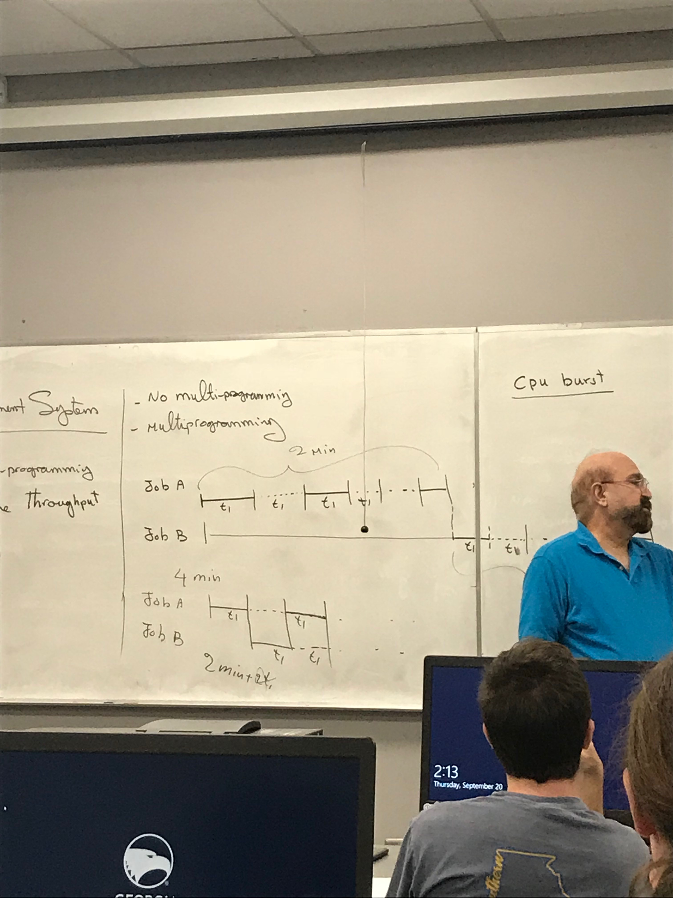
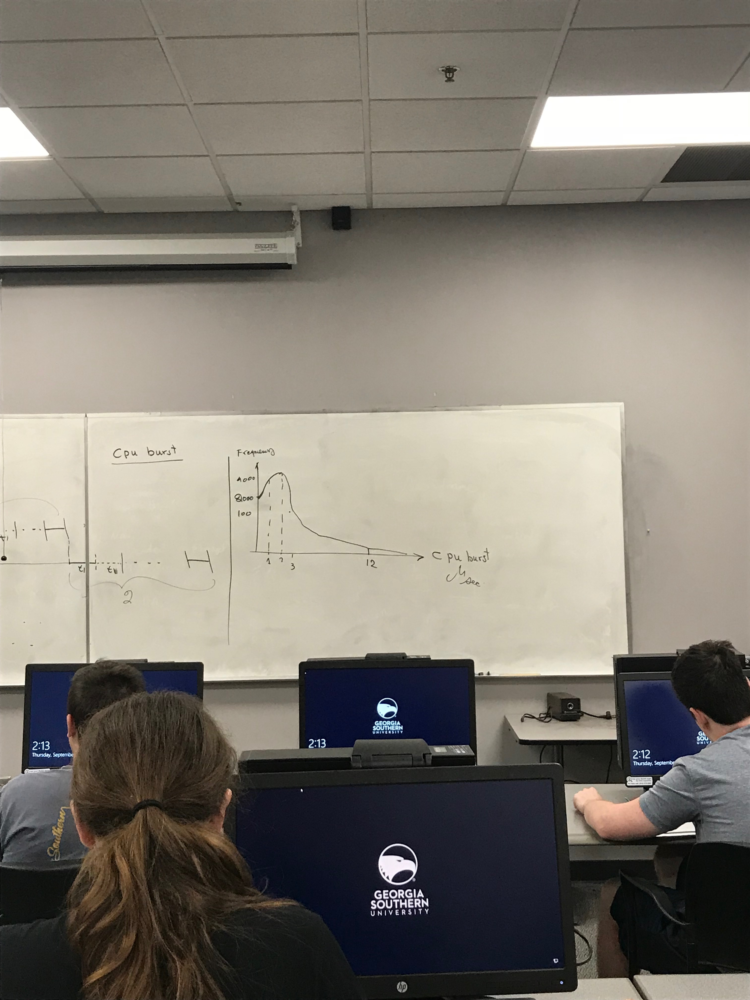
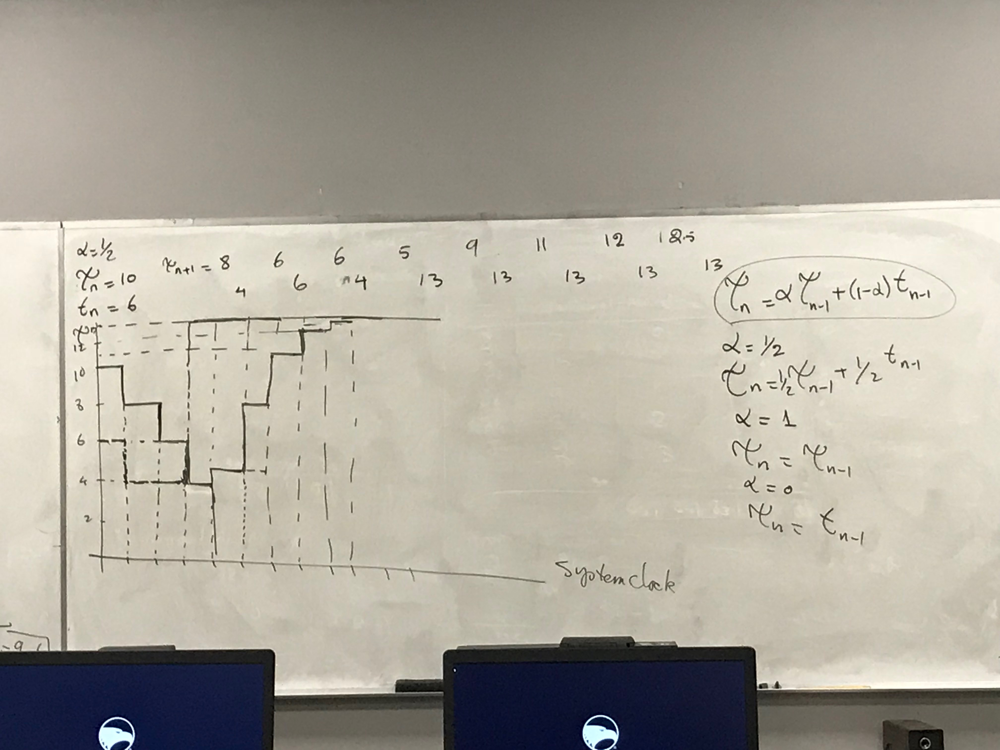

# Lecture 10
### Announcements
Midterm next Thursday

Assignment 1 Will Be Handed Out Next Class
# Lecture Notes

## CPU Management System

**Reason we need a CPU management System:**
Because of Multi-Programming

**Goal of CPU management System:** Improve Throughput 

**Throughput**: Amount of work a CPU does in one interval of time.

## Compare Systems
Suppose we have 2 jobs, Job A and Job B.

Job A starts at a point and uses the CPU for a period of time, t1. 
The Job then waits for I/O for another t1 interval.

```
System Without Multiprogramming
Job A
|-----|. . . .|-----|. . . .|
  t1      t1     t1     t1
 
 
|     (2 minutes total)     |
  
Job B
|. . . .. . . . . .. . . . . | |-----|. . . .|-----|. . . .|
                                 t1     t1     t1

|     (2 minutes total)     |  |     (2 minutes total)     |

This system takes 4 min total
```
```
System With Multiprogramming
Job A 
|-----|. . . .|-----|

Job B
|.....|-------|. . .|

This system takes 2 min total
```
As we can see, the Multiprogramming system is faster



### CPU Burst

**CPU Burst**: (TODO: Listen to recording for more detail) Utilization of CPU is a CPU burst. 

Assume that all jobs can be finished in 1 CPU burst (not reality).
If you collect all bursts for N processes, we find : 




We call system for graph image, a CPU bound system. (TODO Improve definition of CPU bound system)  


## Improving Throughput of CPU
We have choices of several different scheduling algorithms. We need a way to measure the performance of each one. 

## Performance Criteria
Criteria for comparing algorithms. We want to maximize and minimize certain criteria. 
1. CPU Utilization (MAX): The algorithm that utilizes the CPU more will have better CPU Utilization. In practice utilization is between 40% - 90%
2. Throughput (MAX): The amount of work CPU is doing in one unit of time. 
3. Turnaround Time (MIN): t1 moment you submit/click on run icon, t2 last character of output shows up on the screen. Thus, `Turnaround Time = t2 - t1`. 
4. Response Time (MIN): t1 = When you click on the run icon. t2 = time of the first character of output shows up on screen. Thus, `Response Time = t2 - t1`
5. Waiting Time (MIN): Time that a process or a job is waiting/sitting in a ready queue. If the process sits in the queue more than time, the sum of the time spent waiting is equal to its waiting time. (TODO: Improve this definition) 

## Machine CPU Comparision
a) M1 can finish a process in minimum: t1 seconds, and maximum: tm seconds.
b) M2 can finish a process on average: tk

Go with (b), average is better case.

## Scheduling Algorithms
### Algorithm 1. First-Come-First-Serve (FCFS)

#### Calculating Average Turnaround Time
Example 1
```
Job | CPU Burst | Arrival Time
-------------------------------
J1  | 25        | 0
J2  | 5         | 0
J3  | 5         | 0

35 | J3 | 30 | J2 | 25 | J1 | 0 | (start at 0)

Turnaround Time For Each Job: 
J1: 25
J2: 30
J3: 35

Average = (25 + 30 + 35) / 3 = 30
```

Example 2
```
Job | cpu burst | arrival time
-----------------
J1  | 5         | 0
J2  | 15        | 0
J3  | 9         | 1
J4  | 8         | 2
J5  | 2         | 3

39 | J5 | 37 | J4 | 29 | J3 | 20 | J2 | 5 | J1 | 0 |

Turnaround Time For Each Job: 
Job Time = (Finished - Arrival)
J1: 5  - 0 = 5
J2: 20 - 0 = 20
J3: 29 - 1 = 28
J4: 37 - 2 = 35
J5: 39 - 3 = 36

Average Turnaround Time = (5 + 20 + 28 + 35 + 36) / 5 = 124 / 5 = 24.8
```

#### Calculating Average Waiting Time
Job Wait Time = (Finished - Arrival) - (Time Working)
Using Example 2 from the previous section:
```
Job Wait Times
J1: (5 - 0) - 5 = 0
J2: (20 - 0) - 15 = 5
J3: (29 - 9) - 9 = 19
J4: (37 - 2) - 8 = 27
J5: (39 - 3) - 2 = 34

Average Wait Time = (0 + 5 + 19 + 27 + 34) / 5 = 7
```

### Algorithm 2. Shortest-Job-First (SJF)
A special type of priority algorithms where jobs are prioritized by their CPU burst time. 
#### Calculating Average Turnaround Time
```
Job | CPU Burst | Arrival Time
-----------------
J1  | 25        | 0
J2  | 10        | 0
J3  | 5         | 0
J4  | 8         | 2
J5  | 2         | 2

Shortest CPU Burst goes first. 
At time 0, shortest is J3
At time 5, shortest job is now J5, so it goes next.

50 | J1 | 25 | J2 | 15 | J4 | 7 | J5 | 5 | J3 | 0 |


Job Turnaround Times: 
J1: 50 - 0 = 50
J2: 25 - 0 = 25
J3: 5 - 0 = 5
J4: 15 - 2 = 13
J5: 7 - 2 = 5

Average Turnaround Time = (50 + 25 + 5 + 13 + 5) / 5 = 19.6
```

#### Calculating Average Waiting Time
```
Job | CPU Burst | Arrival Time
-----------------
J1  | 25        | 0
J2  | 10        | 0
J3  | 5         | 0
J4  | 8         | 2
J5  | 2         | 2

Shortest CPU Burst goes first. 
At time 0, shortest is J3
At time 5, shortest job is now J5, so it goes next.

50 | J1 | 25 | J2 | 15 | J4 | 7 | J5 | 5 | J3 | 0 |


Wait Time of Jobs: 
J1: 50 - 0 - 25 = 25
J2: 25 - 0 - 10 = 15
J3: 5 - 0  - 5 = 0
J4: 15 - 2 - 8 = 5
J5: 7 - 2 - 2 = 3

Average Wait Time = (25 + 15 + 0 + 5 + 3) / 5 = 9.6
```

## Prediction 

A drawback of using SJG (even though it is better) is that we don't know CPU burst beforehand. 

We predict Job 1 CPU burst to take: `tou_1` and it actually takes: `t1`

```
tou_n = alpha * tou_n-1 + (1 - alpha ) * t_n-1
alpha = 1/2 (take half of new history and old history to make next prediction)
tou_n = (1/2) * tou_n-1 + (1/2)* t_n-1

When alpha = 1, we ignore the actual and go with history
tou_n = tou_n-1

When alpha = 0, we ignore the history and go with actual
tou_n = t_n-1
``` 

```
alpha = 1/2
tou_n = 10
t_n = 6
```

Hypothetically, as time goes on, the predictions get close to the reality. 

### Algorithm 3. Priority Algorithms
Algorithms that assign priority to jobs based on internal and external priorities. 

Internal Priorities: Whatever is related to the job itself
- Number of lines 
- How big is the program
- How many files to open

External Priorities: 
- Who you are

