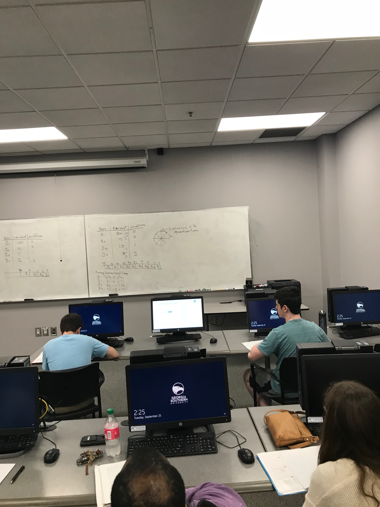

# Lecture 11
### Announcements

# Lecture Notes

### Last Session: 
CPU Management System
Algorithms For Scheduling Jobs
1. FCFS (First Come First Serve)
2. SJF (Shortest Job First)
3. Priority 
    1. Internal: Parameters are those that are determined by your process (size, ) 
    2. External: Parameters are those that are determined by who you are. 
    
## Starvation
```
Jobs  |  CPU Burst   | Arrival Time
J1       100            0
J2       5              0
J3       7              1
J4       2              3

Using the SJF Scheduling Algorithm:
________________________________________
104| J1| 14 | J3 | 7 | J4 | 5 | J2 | 0 |

```

In this case, J1 suffers from **Starvation.** Because it doesn't get the attention of CPU.

**Solve starvation by Aging:** If a job is waiting for X units of time, we change it's priority over time (as it ages) so that sooner or later the job gets the attention of the CPU.

## 4. Round Robin

```
Jobs  | CPU Burst | Arrival Time
J1        24        0
J2        5         0
J3        12        1
J4        8         2

Let time slice = 6

Job Queue:
49 | J1 | 43 | J1 | 37 | J4 | 35 | J3 | 29 | J1 | 23 | J4 | 17 | J3 | 11 | J2 | 6 | J1 | 0 |

J1 Reamining: 18, 12, 6, 0
J3 Remaing: 6, 0
J4 Remaing: 2, 0
```

### RR Average Turn Around Time
```
Turnaround Time Per Job:
J1: 49 - 0 = 49
J2: 11 - 0 = 11
J3: 35 - 1 = 34
J4: 37 - 2 = 35

Average Turnaorund Time = (49 + 11 + 34 + 35) / 4 = 32.25
```

### Processor Sharing
When time slice it too large, then Round Robin works exactly like FCFS.

When time slice is too small, we have **processor sharing**.

In processor sharing, we have the problem of context switching. 

#### Solutions
1. Hardware Solution: If we have as many sets of registers as we have jobs.
2. Software Solutions: We must do context switching between jobs.

## 5. Preemptive Algorithms
In a Preemptive Scheduling Algorithm, when the CPU is working on a job, you kick out the CPU in the middle of a job based on some criteria (shorter job, arrivial time, etc.).

We have Preemptive:
1. SJF (Shortest-Job-First)
2. RR (Round Robin)

### 5.1 Preemptive SJF (As A Separate Algorithm)
Suppose we have
```
Job  |   CPU Burst   | Arrival Time
J1          9            0
J2          6            2
J3          4            3
J4          1            4


If a new job arrives that is less than the remaining burst time of the current job, the current job is kicked out and replaced by the arriving job. After all jobs have arrived, just perform regular SJF scheduling

 20 | J1 | 13 | J2 | 8 | J3 | 5 | J4 | 4 | J3 | 3 (J3 Arrives) | J2 | 2 (J2 enters bc smaller remaining CPU burst) | J1 | 0
```

#### Average Turn Around time of Preemptive SJF
```
J1: 20 - 0 = 20
J2: 13 - 2 = 11
J3: 8 - 3 = 5
J4: 5 - 4 = 1

(20 + 11 + 5 + 1) / 4 = 9.25
```

#### Average Waiting Time of Preemptive SJF
```
J1: 20 - 0 - 9 = 11
J2: 13 - 2 - 6 = 5
J3: 8 - 3 - 4 =  1
J4: 5 - 4 - 1 = 0

(11 + 5 + 1 + 0) / 4 = 4.25
```

### 5.2 Preemptive RR (As A Separate Algorithm)
Suppose we have
```
Job  |   Cpu Burst   | Arrival Time
J1          9            0
J2          6            2
J3          4            3
J4          1            4


Time Slice = 6
Work in order: J1, J2, J3, J4


20 | J2 | 14 (only had 4 J1 left) | J1 | 9 (since J2 isn't < 6, we keep J1) | J3 | 5 (Since J1 and J2 have >= burst than 6 (the TS) they are skipped | J4 | 4 (TS = 6 - 4 = 2) | J1 | 3 (TS = 6 - 3 =  3) | J1 | 2 (J1 remaining slice 6 - 2 = 4, smaller than 4 so keep J1) | J1 | 0
```

#### Average Turnaround Time of Preemptive RR 
(TODO: Not done in class)
#### Average Waiting Time of Preemptive RR 
(TODO: Not done in class)

