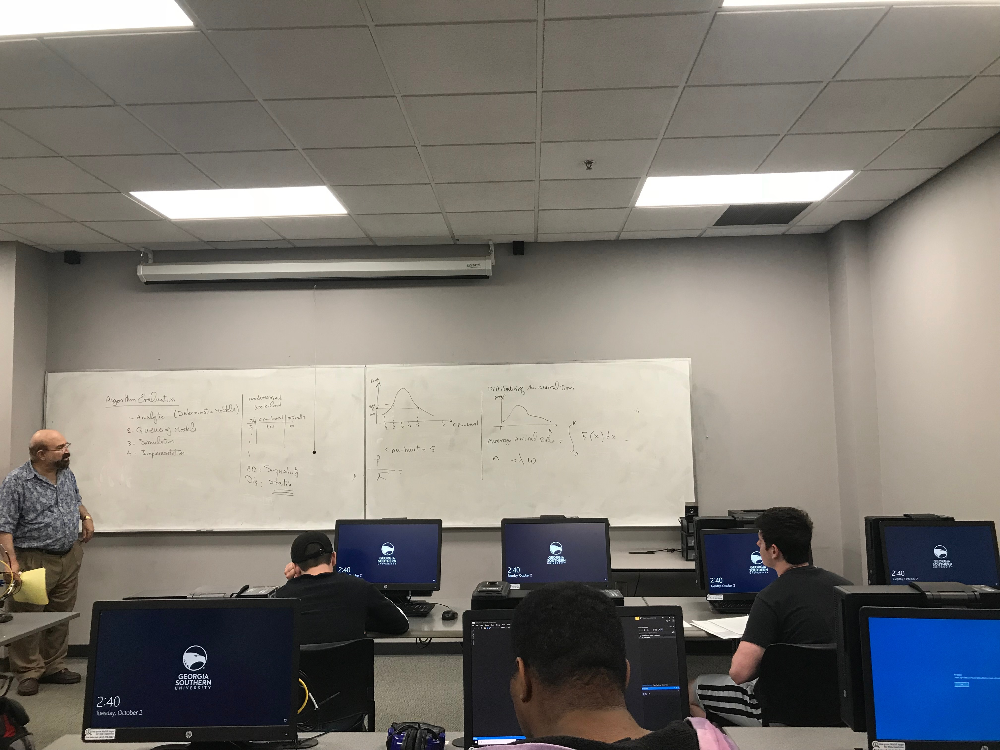

# Lecture 12

### Announcements
Midterm this Thursday (Next Class)

# Lecture Notes
### Algorithm #6: Multi-Level Queues 
Ready Queues are not single queues, but multiple queues. 
Jobs are categorized:
1. System Jobs
2. Interactive Jobs
3. Batch Jobs
4. (etc.) as categorized by the manufacturer. 

Each category maps to a specific queue.

Queues In Order:
1. (first) System Jobs. This queue has the highest priority. 
2. (second) Interactive Jobs. This queue has the second highest priority. 
3. (third) Batch Jobs.
4. (fourth, fifth, etc.) 

Each queue could be scheduled with a different algorithm.

The queues have priority based on their order. Each queue doesn't execute until the queue above it is empty. If a new job comes in that is in a higher queue, it preemptively takes over the CPU. This causes starvation among jobs in lower  categories/queues.

### Algorithm #7 Multi-level Feedback Queues
Ready queue is made up of several queues. Priority is top to bottom (just like multi-level queue).

Unlike the ready queue, all jobs go to the top queue. If they are not completed in the allotted time slice, they move down the queue.

```
=------------------------------
Queue 1 with quantum time = 3
-------------------------------
Queue 2 with quantum time = 5
-------------------------------
Queue 3 with quantum time = 10
-------------------------------
Queue 4 with quantum time = 20
-------------------------------
```

Just like multi-queues, anything that enters in a higher queue will interrupt (preemptive) the lower queue and take over. This algorithm helps jobs that have shorter CPU bursts get done more quickly. 

Starvation is still a problem. However we resolve starvation by moving jobs back up the queue to a higher priority queue as they age. 

## Algorithm Evaluation
We have several techniques for comparision
1. Analytic (Deterministic Models): Means we have a predefined/predetermined workload. As an example he drew the table of the jobs, their CPU bursts, and their arrival times. When we have this data we know our workload.
    1. Advantage: Simplicity. 
    2. Disadvantage: Static (may not reflect the actual workload).

2. Queuing Models: They assume that if you look at a computer, every resource has a queue (CPU has a queue, memory has a queue, I/o has a queue, so on and so forth). (TODO: Every resource has a server?)
    1. Advantage: Uses dynamic data (more accurate reflection of workload)
    2. Disadvantages: 
        1. Calculations are difficult to understand and impractical to use.
        2. Make assumptions. In the example, we make the assumption that queues have the same rate of entering as they do leaving. Arrival rate = departure rate to get `n = lambda * w` = `length of queue = average arrival time * average wait time.`
        
3. Simulation: System builds an architecture inside that fits a model you have in mind. You send a set of inputs (data) to the simulation. (TODO: Need correct definition and advantage)
    - Advantage:
    - Disadvantage: Not the real thing

4. Implementation: The real thing. Use the real algorithm on systems and collect data on how it performs. 
    - Advantage: Only way to get the real time
    - Disadvantage: As you collect data over time, the usage of your testing machine is changing
    
    
The following image is a demonstration of the complexity of using queuing models. 


# Review of Lecture 11 Preemptive Round Robin
Suppose that you have job, `J_i`, and CPU burst for this job is `C_i`.

Then we have jobs `J_k` and bursts `C_k`.

Suppose we have quantum time `q`

i is the current job the CPU is working with.

`J_k` arrives at time `t_k`

`R` remaining of quantum = `q - t_k`

`a` = remaining CPU Burst for `J_i`
`a = c_i - t_k`

**Follow 3 Rules:**
1. if `c_k < R` and `c_k < a`, then `J_i` is preempted by `J_k`

If a job is finished within a quantum, we need to pick up another job. Whatever is leftover from the quantum, we throw it away.  
2. if `J_x` is finishing within `q`, remaining of `q` is ignored and the next job is selected, and a fresh `q` is given. 

If `J_x` is finished, we need to know what the next job to select will be. If only one job is remaining we go with it, otherwise:
3. if there are several jobs as candidates for being selected, then choose the next Job, `j_y`. Select `j_y` that has the shortest CPU burst from that remaining jobs **WHERE** each of the CPU bursts being compared are `< q`. If no remaining jobs have a CPU burst `< q`, then simply choose the next Job in the Round Robin order. If CPU bursts amongst remaining jobs that are eligible are tied for remaining CPU bursts, choose the first job in the RR order that is tied. 

**NOTICE:** We say `< q` NOT `<= q`

## Preemptive Round Robin Example
```
Job | CPU Burst | Arrival Time
J1  |    9      |      0
J2  |    5      |      1
J3  |    3      |      2
J4  |    3      |      3
J5  |    5      |      4

q = 6 (quantum slice)

Resulting Job Queue:
25 | J1 | 24 | J1 | 18 | J2 | 13 | J5 | 8 | J4 | 5 | J3 | 4 | J3 | 3 | J3 | 2 | J1 | 1 | J1 | 0
```

# Assignment 1
The rest of the lecture was spent discussing [Assignment 1](../assignments/assignment_1) and the contents can be found in the [assignment_1](../assignments/assignment_1) directory.

Here I'll include the concepts that we may be tested on. 

What are the functions used to create, join, and exit a thread? What are each of their parameters? 

### Create a p-thread
`pthread_create(&thread_id, null, part1, (void*)message);`

Where

1. `&thread_id` = The pointer to the thread ID
2. `null` = Thread attributes (none passed in)
3. `part1` = Name of the thread
4. `(void*)message` = The message that will be sent to the thread

It returns either 0 (successful creation) or 1 (unsuccessful creation).

### Exit a p-thread instance
Within the `void *part1(char *section1)` code block:

`pthread_exit("test");`

### Suspend Execution in calling thread until target thread terminates
`pthread_join(thread_id, &threadPointer)`

Where

1. `thread_id` = The pointer to the thread ID
2. `&threadPointer` = The return value of thread1 is stored in the location pointed to by threadPointer. This value can be null (no return). 


