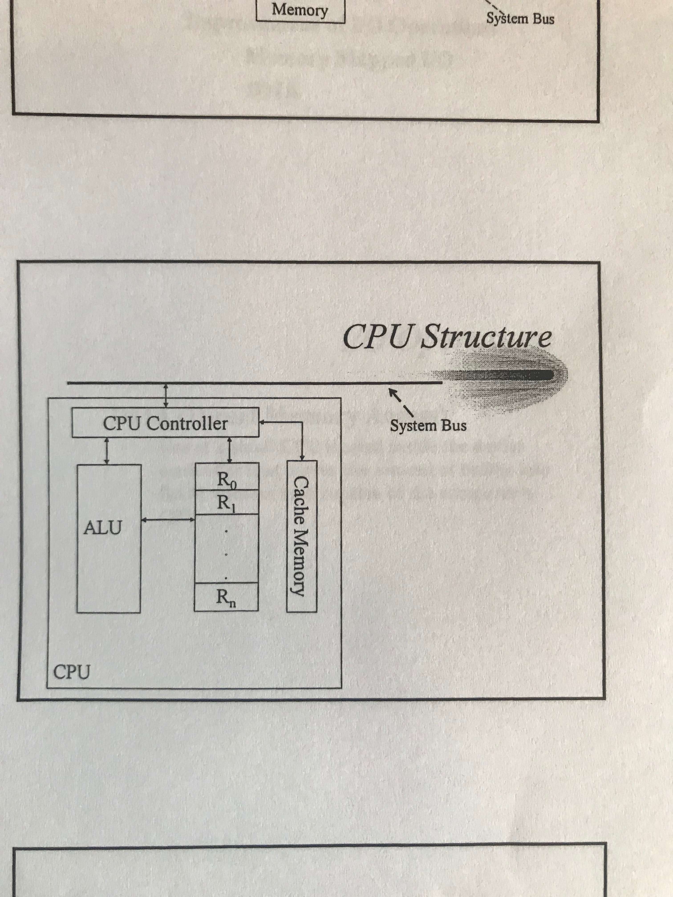

# Lecture 4
### Announcements
Quiz on Thursday (9/6)

### Lecture 3 Questions
- Parallel vs Cluster Systems? Both has symmetric (independent) and asymmetric (single controlling other nodes)  
    - Parallel: Single box, Cluster: Multiple computers bridged together (not shared bus, etc.)

- What is event driven software?
    - Event Driven Software == Operating System (Does nothing until an event happens)

# Lecture Notes
One controller per kind of I/O device

### Controllers (io devices)
- Disk Controller
- USB Controller
- Tape Drive Controller

### Device Driver vs Device Controller: 
- Device Driver: 
    - Software, internally customized for the device being used. Externally, it provides an interface for the OS in some device category. Every external interface in that category is the same, even if the internal interface differs. 
- Device Controller:
    - Hardware, permits that a device be connected to your computer (place where it is plugged in)
    
### Computer System Architecture
- CPU
- I/O Devices
- I/O Device Controllers
- Memory
- Memory Controller
- System Bus

## CPU Structure

ALU: Arithmetic-Logic-Unit Does arithmetic and logic operations

Registers: Memory space, with high speed. Faster and more expensive than RAM.
   - General Purpose Registers: 
        - ALU operates on items that must first be set in GPRs 
   - Special Purpose Registers
        - Registers dedicated to a specific function 
        - Examples:
            - PC (Program Counter address of instruction)
            - IR (Fetched program from RAM sits in IR)
            
Cache Memory: Faster than RAM, slower than registers. CPU has its own cache memory. Any piece of data that leaves CPU first is stored in cache memory for a time, because it may be used by the next instruction. In this sense, the data is *cached*.

### CPU Controller
Controls any movement of data or communications among components of the CPU and RAM.

Example: ALU is told add 5 + 6, CPU control is the one who moves the 5 and 6 into registers.


### I/O Structure
- Device (hardware)
- Device Controller (hardware): Permits connection of I/O devices to computer. One controller per kind of device. 
- Device Driver (Software): Internally custom tailored to specific device, but externally presents a uniform interface for the device to the rest of the OS. The interface is per kind (category).
- Kernel (I/O Subsystem)

### Device Controller
n devices of same kind. 

i.e. Device1, Device2, ... DeviceN

All connected to one device controller. 

#### Structure
Has a set of registers that are used to tell the I/O devices what type of I/O operation wants to be done (read, write), all the pieces that the command needs is set in the registers. One register reserved for type of I/O, the rest carry the information about what the command wants to do.  

CPU puts the data in the registers. 

Also has buffer.

**Buffer**: Memory Space

Before sending data read from device to CPU, it is stored in the buffer. We need to do this because data becomes in pieces. Once finished, signal is sent to CPU to get contents of buffer. 

## How an I/O takes place
Example: Running Java program and read a record. You need to read data from file residing on disk.

Whenever a read/write happens, a trap is fired so that the OS steps in and does the reading in place of the program. 

A trap fires from the program when it needs to perform I/O. The OS receives the trap signal, context switching takes place, and the response is executed. The response is received by device driver and sent to the device controller.

### Synchronous Option 1:
Meanwhile CPU:
   - Uses loop: `A: Jump to A;`to wait for data to be fetched
   - At the end of each iteration, checks *ready bit* that will be set to 1 when the data in the buffer is ready. 

Once ready, CPU exits the loop and moves the buffer's contents to RAM. 

Afterward, the execution of the trapped program continues
    
This option is called:
- Programed I/O or Synchronous I/O


### Asynchronous Option 2:
CPU picks up another process and works on it until it receives an interrupt from the device driver to move the buffer's contents to the RAM, rather than waiting in a while loop.

Afterward, the execution of the trapped program continues.

This option is called:
- Interrupted I/O or Asynchronous I/O

### Device Status Table
Used to keep track of other processes 

When an Asynchronous I/O operation takes place, multiple programs can request data from the same device. To keep track of I/O operations that are running asynchronously, we use a linked list. 
 
Ex.
1. Multiple devices D0, D1, ... DN, are attached to one controller.
2. Program needs data from a device, D1
3. From each device, a linked list is created to keep track of processes and the data needed for each device

### How to Improve I/O Operations?
#### Memory Mapped I/O 
We emulate physical registers inside the device controller. Instead of having physical registers in the device controller, we have a pointer to memory spaces allocated in RAM that emulate physical registers from the perspective of the device controller. This way, the CPU doesn't have to write to device controller registers, but can just pass the pointer to the registers existing in the RAM. 

#### DMA (Direct Memory Access)
Use a separate smaller CPU to move buffer memory to RAM and handle Device Controller CPU requirements without using the computers main CPU.

## Memory
**RAM**: (Random Access Memory): 
1. Any part of the memory can be accessed randomly rather than sequentially. 
2. It is volatile (doesn't persist over computer sessions / power on/offs).
3. Access time is always fixed.

**ROM** (Read Only Memory):
- Cannot be written to, but can be read from

**PROM** (Programmable Read Only Memory):
- One-time writable memory. Mistakes make it invalid

**EPROM** (Erasable Programmable Read Only Memory):
- Can be erased physically, using UV light

**EEPROM** (Electronically Erasable Programmable Read Only Memory)
- Can be erased electronically 

### Hierarchy of Memory Speed (descending order)
- Registers
- Cache
- RAM
- Disks
    - Solid State Disks
    - Magnetic Disks
    
### Cache Memory (CPU Cache Memory: L1, L2, L3, and L4)
```diff
- This section needs improvement
TODO
``` 
   - Caching
        - ?
   - Hardware caching (pipelining)
        - At any given time one program is being fetched, one is decoding
        - One way to increase speed ?
   - Coherency
        - Whatever is being done that collectively maintains consistency is called Coherency. 
        - Data in cache memory must be consist. The process to enforce consistency is called Coherency. 
   
## Steps of Running a Computer System
1. Bootstrapping:
    1. Loads a copy of the OS kernel from the disk into the RAM
    2. Initializes the essential elements of computer for program to run
    
Located on motherboard on BIOS/ROM Chip.

BIOS (Basic Input/Output System) [Name of bootstrap Program]
- Built in software
- Boot Rom (Rom Chip)
    - **Shadowing**: Copying and running BIOS from ROM to RAM 
- Upgradeable (Flash Memory Chip)
    - Can be changed/updated
- PnP (Plug and Play)
    - If BIOS is able to initialize configuration and mount it for you