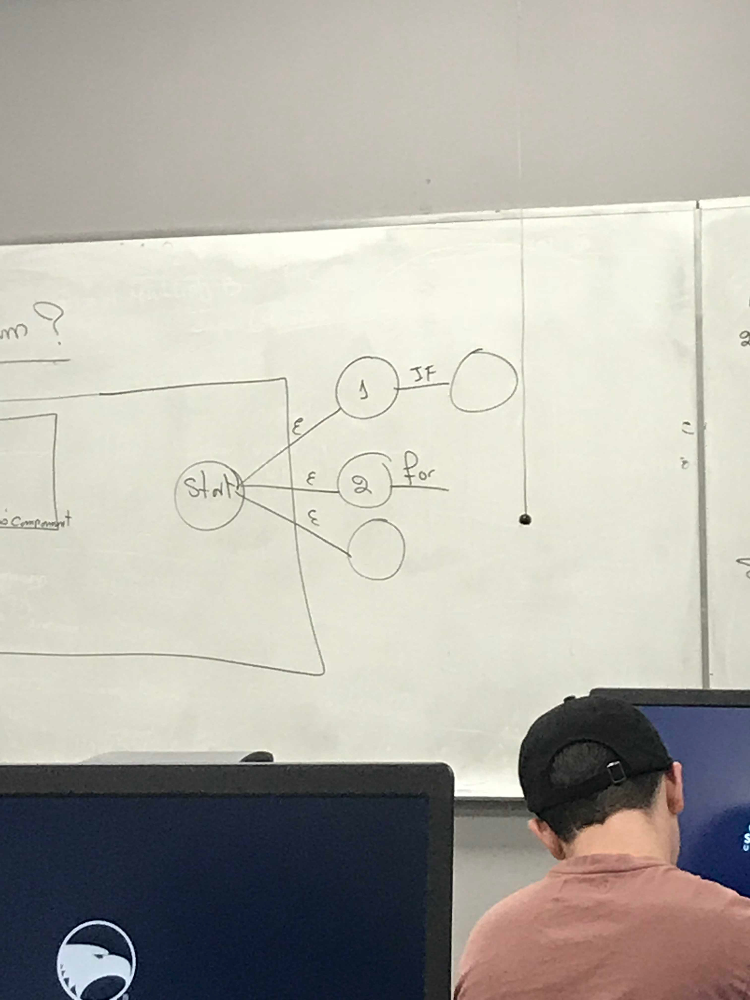
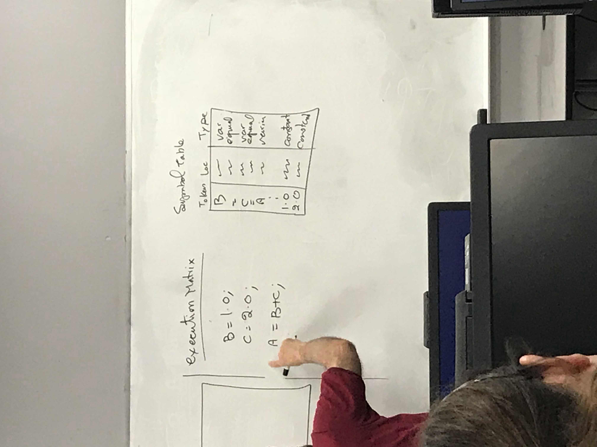

# Lecture 5
### Announcements
Quiz on Thursday (9/6)

### Lecture 4 Questions
None
# Lecture Notes

## OS Services
- Purposes
    - Provide convenience of the user
        - Program Execution
        - I/O Operation
        - File Manipulation
        - Communication
        - TODO: (see slides)
    - Efficiency of computer system operation
 
### Program Execution
- OS provides for the loading, running, and ending of programs

Source Program -> Translator -> Linker -> Loader -> Computer -> Results

#### Programs
1. **Source Program**: Any program written in any language
- A Source program is not edible (understandable) by a computer and must be converted to machine language, so source program is fed to translator.

2. **Translator**: Takes source program and converts it into an *object program/module*
    - **Assembler:** If source program is assembly language, then translator is called assembler. 
    - **Compiler**: When source program is high level, then translator is called compiler.
        - **Compile Time**: Time taken to compile a source program into machine code.


3. **Linker (linkage editor)**: Takes the *object program/module* as input and creates the *executable program/module* as output. 
There are symbols in object program that are unknown to machine. The Linker takes machine code copies of all of the unresolved symbols (libraries, system codes, etc) and combines them to create an *executable program/module*

4. **Loader**: Takes an *executable program/module* and puts it into RAM. 

5. **Computer**: Computes executable program in RAM when it is its turn.

#### Items
**Source Program**

**Object Module**: The translation of source program into machine language with some unresolved symbols. Some symbols have no been converted into machine language.
   - **Unresolved Symbols**:
        - Libraries
            - Example `Math.SQRT`
        - User Defined Libraries
        - System Specific Codes
        
Unresolved symbols combine in linker where they are linked to machine code of the libraries to form the **load module**.

**Load Module / Executable Module**
```diff
- This section needs improvement
TODO
``` 
   1. Program Fetch: Takes load module and puts it in RAM
   2. Loader: Saved on disk permanently and can be run at any time. 
        - Creates everything and loads into RAM, but doesn't save load module

Two types of Object Modules
- Relocatable: All variables are simply offset from beginning of address. 
- Unrelocatable: Never moved. Fixed addresses. 

#### Compiler
Takes a source program written in a high level language and converts it to machine language. 
##### Analysis Component (part 1)
1. Scanner: Takes source program line by line and scans (finds the letters and digits, and special symbols, etc.). Tokenize source program.
    - Example: `A1 = B + 5;`, scanner takes string up to `A1` first and hits eliminator, creating a token "A1". 
    - Creates a symbol table from every piece of data extracted (tokens). 
        - Symbol table for `A1 = B + 5;`
        ```
         Token | Location | Type
         A1      500        var
         =       503        equal
         B       5..        var
        ``` 
2. Syntax and semantic analyzer

**Syntax Analyzer**
   - Makes sure that if you write a statement, the syntax is correct. 
   - Uses automata to verify syntax for every statement. 
   - Example, individual automata for if statement, for statement, etc.
   -  Start of syntax analyzer uses epsilon to move between each of these statements who have their own separate automata, joined by epsilon transitions from starting node. (see image).
    
**Semantic Analyzer** 
   - Build an execution matrix to check for correctness of semantics. 
   - Example: 
   ```
   B = 1.0;
   C = 2.0;
   A = B + C;
   ```   
    
**Symbol Table**
- Constants on bottom, variables on top
```
Token | Location | Type
B       500        var
=       503        equal
C       ...        var
=       ...        equal
A       ...        var
.
.
.

1.0     ...        constant
2.0     ...        constant
3.0     None       T1 (temp)
``` 
      
**Execution Matrix**
  ```
  Number | Opcode | Op1            | Op2            | Temp
  1        =        (Pointer to B)  (Pointer to 1.0)
  2        =        (Pointer to C)  (Pointer to 2.0) 
  3        +        (Pointer to B)  (Pointer to C)    T1 (result)
  4        =        A               (Pointer to T1)
  ```



##### Synthesis Component (part 2)
Translator converts all hundreds of languages to assembly language, then only one compiler to convert from assembly to machine language.

1. Intermediate Code Generation
2. Code Generation


## Interpreter
Creates object module for one statement rather than entire program, and repeats for each statement. I.e. Processes one statement at a time rather than the entire program as the compiler would.

## Java Compiler
Can be interpreter or compiled. 

### Compiler
Creates a load module in bytecode rather than machine language. Then those bytes are converted to machine language of local machine using the JVM, then executed. 