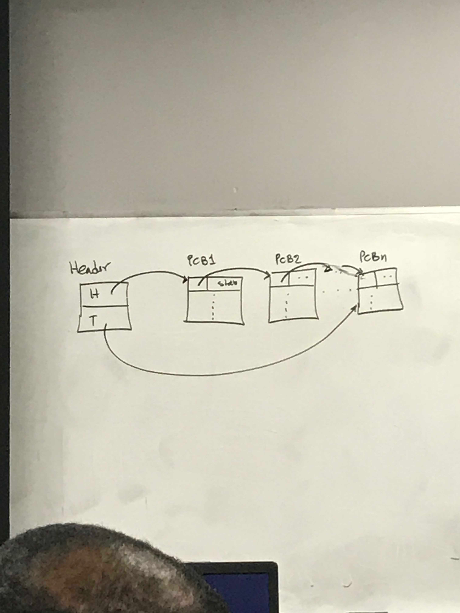
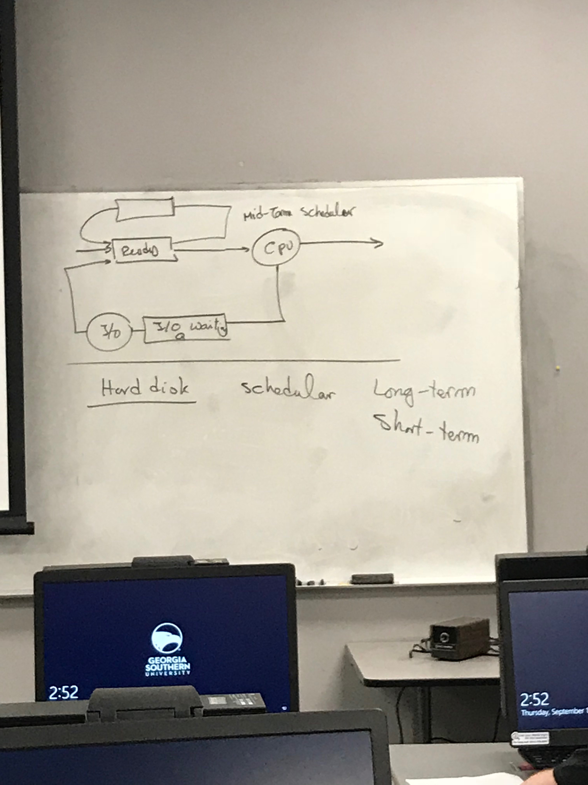

# Lecture 8
### Announcements

# Lecture Notes
## What is a process
**Program:** Passive Entity. 

Program is a text.


**Process:** Program in RAM. Active Entity because it has extra information:
Where is process located, base and limit registers, account the process is running on, what are the contents of registers in CPU, what is the contents of PC for this process, etc. 

Process is a text plus:
- The content of PC register
- The contents of other registers
- It has its own stack
- It has its own data section (including global variables)

Also called a **sequential process** (same meaning)

### States of a process
New State -> (admitted)
1. **New** State: Time program moves from harddisk into RAM (admitted into RAM)
2. **Ready** State: Process is ready to be executed/get attention by/of CPU. 
3. **Running** State: When a process is running 3 cases happen
 - If the process running in a time slice is finished, then it goes to state **4.** the **terminated state**.
 - If the time slice is finished without the process that is running being finished, the process returns to the ready queue OR
 - It goes to **5.** **waiting state**. In this state, the process waits for some I/O operation to be complete, if a process needs to be activated in X time, or for any another reason the program must wait. After what the program is waiting for is provided, it is moved to the **ready queue**.
 - If a program waits long enough without being given what it needs, it goes to **6.** the **deadlock state**

Many processes are admitted to the RAM and go to the ready queue, thus we have many processes in the ready state, giving us a **ready queue**.
Every program in ready state makes a ready queue. 

### Process Control Block
Every process has a process control block (PCP). 
```
Pointer | Process State | Process Number 
----------------------------------

```

- Pointer: If processes are waiting in the ready state, all processes will be linked together as a linked list in waiting state.
- Process State: The current state of the process. (See [States of a process](#states-of-a-process))
- Process Number: Identification number.
- Program Counter: Content of program counter. 
- Register's Contents: Other Registers contents
- Memory Limits: Start of the process in the memory and what is the limit (amount) of memory that can be used by the process.
- List of I/O devices: What file has been open/closed recently. All information about I/O operations for this process are kept here.
- Accounting Information: Who owns the process, how much CPU time is used by the process so far. Every utilization by the process (how much memory is occupied). Who is going to pay for this process if money needs to change hands.


### Queue (Linked List)
Everywhere that you have a queue, it is built as a linked list. The linked list consists of many PCP nodes, with each node containing the contents of the PCP block (pointer, state, etc.). The list has a header node that contains H and T points (Header and tail). Each node has a pointer that points to the next PCP node, **AND** the header (first node) has pointer to the next PCP node (stored in H) and the pointer to the last PCP node (stored in T).

```
H
--
T (points to last node)
```

PCP1
```
Pointer | Information, etc | ...
```

PCP2
```
Pointer | Information, etc | ...
```

.
.
.

PCPN
```
Pointer | Information, etc | ...
```

#### Why do we have a tail?
1. If we want to iterate backwards, we need a doubly linked list using the tail. 
2. If tail is broken, we need to know where we are. (TODO: What did he mean by this / what was his word-for-word explanation?

### Paths after Ready Queue -> CPI

Job comes to Ready Queue -> CPU -> (**split**)

**split:** 
1. Goes out of system OR 
2. Goes to I/O Request OR 
3. Time slice expires OR
4. Fork Child: In a process, suppose main module. Call a new method, then you have a child of the process that is running.  OR
5. Wait for Event

I/O Request -> I/O Queue -> I/O Operation -> Ready Queue 

Time Slice Expire -> Ready Queue

Fork-Child -> Child Execution -> Ready Queue

Wait for Event -> Event happened -> Ready Queue 


For I/O Request you have a queue for each device. (Could be several I/O queues). 

### Process Scheduling
Job comes to Ready Queue -> CPU -> (**split**)

**split**:
1. Out of system (complete)
2. I/O waiting queue

Scheduler: How do we decide which program becomes a process, which process is fed to CPU. The entity of saying whose turn it is in a systematic fashion is the Scheduler. 

In an interactive system, jobs go immediately to the ready queue. 
We live under 2 assumptions
1. Goes directly to ready queue. (Interactive System)

2. Huge system, many users submit programs, program sits on hard disk. 
A lot of programs comes to the system. (Non-Interactive System)
Programs that sit in harddisk are arranged in a queue by scheduler and put into RAM. 

Dependent on size, privileges (who the user is), run time, to give a rank to the program. 

This type of scheduler is called a long-term scheduler. 

**Long term scheduler**: Loader ranks programs and stores them in a queue sends them to RAM (ready queue) one at a time in order. 


**Short term scheduler**: Set of priority/ranking algorithms that puts processes in order within the ready queue. 
 
 Long term scheduler sends to ready queue, and then they are ordered by short term scheduler.
 
 Short term scheduler must be much faster than long term. Short term scheduler also has a higher frequency of making decisions about the order. 
 
 Long Term vs Short Term
 1. Programs on Harddisk vs Processes on RAM (Ready queue)
 2. Slow vs Fast
 3. Lower frequency of making a decision vs higher frequency of making a decision
 
 #### Interactive System
 Every submitted program goes to ready queue. No need for long term. Bigger machines must have a long term scheduler. 
 
 In an interactive system, if we run out of space in the ready queue, we send processes to the disk where they are scheduled by a mid-term scheduler. **Mid-term scheduler** determines the order from which processes swapped from the RAM to the disk should be swapped back into the RAM from the hard disk. 
 Slower than short term, faster than long term. 
 
 ### Long Term Scheduler Jobs
 - Degree of multiprogramming: The number of programs at any given time in the system in the RAM. 
 LT Scheduler controls the degree of MP. It can slow down or speed up frequency of sending from disk to RAM to account for system load.
 
 - Balancing the type of loaded programs
LT Scheduler makes sure that you have a balance between CPU bounded and I/O bounded sent to the RAM.
  
 I/O Bounded Programs: Require a long of I/O operations
CPU Bounded Programs: Need a lot of CPU time

Scenarios where we need balancing:
1. I/O Bounded Programs are all waiting in I/O queue, creating illusion that the ready queue is empty, and the CPU asks for more. 
2. CPU Bounded Programs are all using CPU and nothing is waiting for I/O.

## Dispatcher
Gets the process from front of ready queue and feeds it to the CPU or lets the CPU work on it. 
In charge of saving the current state somewhere and get the CPU to work on a new process. 
Take away connection of CPU to current process and to give the CPU to the next process. By setting up the PC counters, and saving old registers in old state. Assigns PC counter to new process, and lets the CPU work on new process. 

Pure overhead of saving state that we try to bring down. 

### Context Switching Overhead Solutions 
1. Have several set of registers. Just change set of registers being used by CPU, and go back to set with information when continuing a task. 
2. Designate part of kernel RAM to emulate registers. 

### A process creates a new process
Process Creation:
- Execution
1. Parent waits for child to be completed
2. Parent runs in parallel with child
- Sharing
If parent and child share resources 3 cases: (yes, no, partial sharing).


### Process termination
1. Finished successfully 
2. A parent wish
    - Due to no further use for the task performed by the child process.
    Examples: Suppose huge database where processes are split to search for data. If one finds it, then others aren't needed.
    - Child over stepped boundary in use of resources. 
3. Cascading termination: Parent of child process is deleted. 

Use `kill id#` each process has a unique id#. 