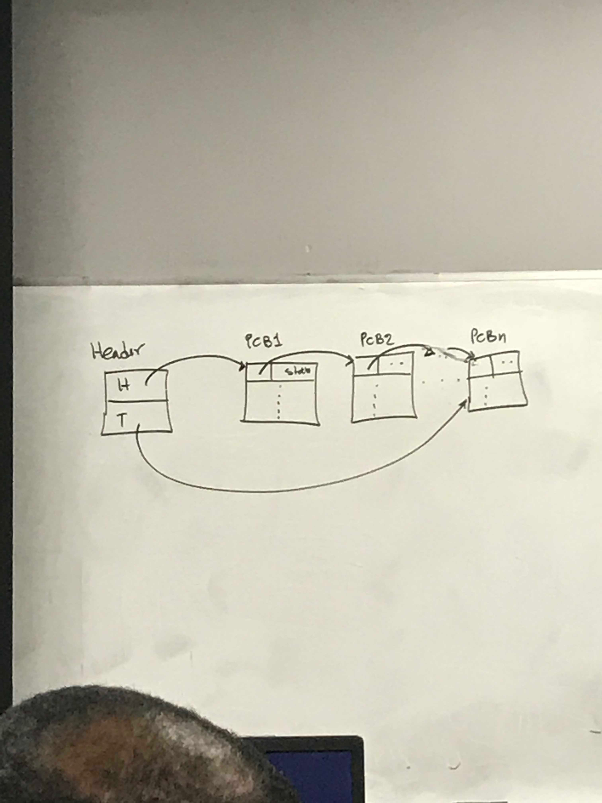
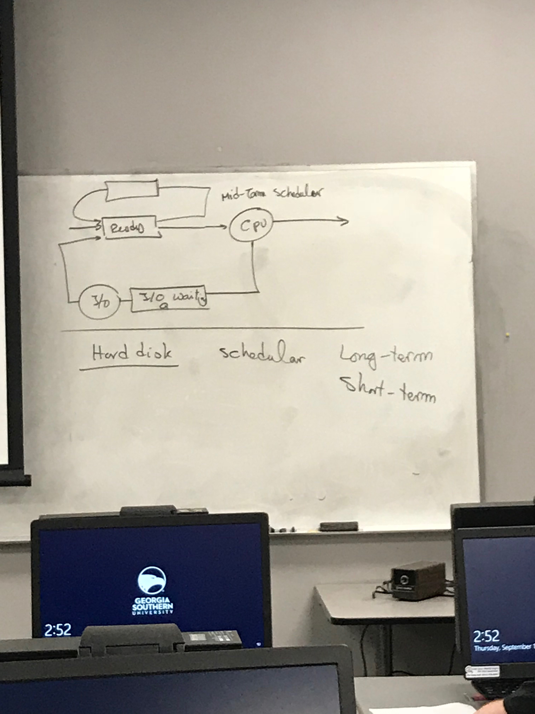

# Lecture 8
### Announcements

# Lecture Notes
## What is a process
**Program:** Passive Entity. 

Program is a text.


**Process:** Program in RAM. Active Entity because it has extra information:
Where is process located, base and limit registers, account the process is running on, what are the contents of registers in CPU, what is the contents of PC for this process, etc. 

Process is a text plus:
- The content of PC register
- The contents of other registers
- It has its own stack
- It has its own data section (including global variables)

Also called a **sequential process** (same meaning)

### States of a process
New State -> (admitted)
1. **New** State: Time program moves from harddisk into RAM (admitted into RAM)
2. **Ready** State: Process is ready to be executed/get attention by/of CPU. 
3. **Running** State: When a process is running 3 cases happen
 - If the process running in a time slice is finished, then it goes to state **4.** the **terminated state**.
 - If the time slice is finished without the process that is running being finished, the process returns to the ready queue OR
 - It goes to **5.** **waiting state**. In this state, the process waits for some I/O operation to be complete, if a process needs to be activated in X time, or for any another reason the program must wait. After what the program is waiting for is provided, it is moved to the **ready queue**.
 - If a program waits long enough without being given what it needs, it goes to **6.** the **deadlock state**

Many processes are admitted to the RAM and go to the ready queue, thus we have many processes in the ready state, giving us a **ready queue**.
Every program in ready state makes a ready queue. 

### Process Control Block
Every process has a process control block (PCP). 
```
Pointer | Process State | Process Number 
----------------------------------

```

- Pointer: If processes are waiting in the ready state, all processes will be linked together as a linked list in waiting state.
- Process State: The current state of the process. (See [States of a process](#states-of-a-process))
- Process Number: Identification number.
- Program Counter: Content of program counter. 
- Register's Contents: Other Registers contents
- Memory Limits: Start of the process in the memory and what is the limit (amount) of memory that can be used by the process.
- List of I/O devices: What file has been open/closed recently. All information about I/O operations for this process are kept here.
- Accounting Information: Who owns the process, how much CPU time is used by the process so far. Every utilization by the process (how much memory is occupied). Who is going to pay for this process if money needs to change hands.


### Queue (Linked List)
Everywhere that you have a queue, it is built as a linked list. The linked list consists of many PCP nodes, with each node containing the contents of the PCP block (pointer, state, etc.). The list has a header node that contains H and T points (Header and tail). Each node has a pointer that points to the next PCP node, **AND** the header (first node) has pointer to the next PCP node (stored in H) and the pointer to the last PCP node (stored in T).

```
H
--
T (points to last node)
```

PCP1
```
Pointer | Information, etc | ...
```

PCP2
```
Pointer | Information, etc | ...
```

.
.
.

PCPN
```
Pointer | Information, etc | ...
```

#### Why do we have a tail?
1. If we want to iterate backwards, we need a doubly linked list using the tail. 
2. If tail is broken, we need to know where we are. (TODO: What did he mean by this / what was his word-for-word explanation?

### Paths after Ready Queue -> CPI


*See the 3rd slide/box in [Lecture 8 Slides](../lecture_7%20(9-11)/slides_8.pdf) for an accurate depiction of the queue paths*. 

Job comes to Ready Queue -> CPU -> (**split**)

**split:** 
1. The job leaves the system (completed) 
   - **Path:** Job comes to Ready Queue -> CPU -> Leaves System

2. **I/O Queue:** The job waits for an I/O Request  
   - **Path:** Job comes to Ready Queue -> CPU -> I/O Request -> I/O Queue -> I/O Operation -> Ready Queue 

3. **Time Slice Expired Queue:** The job's CPU time slice expires and Job is sent back to Ready Queue. 
   - **Path:** Job comes to Ready Queue -> CPU -> Time Slice Expire -> Ready Queue

4. **Wait For An Event Queue:** The job waits for an Event.
   - **Path:**  Job comes to Ready Queue -> CPU -> Wait for Event -> Event happened -> Ready Queue 

5. **Fork a Child Queue:** The jobs forks a new child process. 
   - **Path:** Job comes to Ready Queue -> CPU -> 
Fork-Child -> Child Execution -> Ready Queue


For each I/O request, you have a queue for each device that is being requested. Each queue is a linked list, and each device has a queue. This queue is the Device Status Table from  [Lecture 4](../lecture_4%20(8-28)))

### Process Scheduling
Remember that a job comes to Ready Queue -> CPU -> (**split**)

**split**:
1. Out of system (complete)
2. I/O waiting queue

**Scheduler:** How do we decide which program becomes a process, and which process is fed to CPU? The entity that uses a systematic method to determine the order that process are sent to the CPU is the Scheduler. 


#### Interactive vs Non-Interactive System Scheduling
Two assumed methods of scheduling:
   1. **Interactive System. Smaller, possible personal computer system:** In this system, jobs go directly to the ready queue and don't use a scheduler because they don't need to (RAM is big enough to hold ready queue). 

   2. **Non-Interactive System. Huge system where many users submit programs:** Instead of being sent to the ready queue where they would fill up memory, programs sit on hard disk. Programs that sit in hard disk are arranged in a queue by the *scheduler* and then put into RAM by the scheduler in a way that does not flood the memory.

This type of scheduler is called a long-term scheduler. 

**Long term scheduler**: Loader ranks programs on the hard disk and places them in a queue. From there they are sent to  the RAM (ready queue) one at a time in order. 

Long Term Scheduler Ranking dependent on:
  - Program Size
  - Privileges (who the user is that executed the program)
  - Estimated program run time.

**Short term scheduler**: Set of priority/ranking algorithms that puts processes in order within the ready queue (that resides in memory). 
 
 Long term scheduler sends to ready queue, and then they are ordered by short term scheduler.
 
 Short term scheduler must be much faster than long term. Short term scheduler also has a higher frequency of making decisions about the order. 
 
 Long Term vs Short Term
 1. Programs on hard disk vs Processes on RAM (Ready queue)
 2. Slow vs Fast when making ranking decisions
 3. Lower frequency of making a decision vs higher frequency of making a decision
 
 #### Mid Term Scheduler
 Every submitted program goes to ready queue. No need for long term. Bigger machines must have a long term scheduler. 
 
 In an interactive system, if we run out of space in the ready queue, we send processes to the disk where they are scheduled by a mid-term scheduler. **Mid-term scheduler** determines the order of which processes swapped from the RAM to the disk should be swapped back into the RAM from the hard disk. 

The mid-term scheduler is slower than the short term scheduler, but faster than the long term scheduler. (In the middle)

 ### Load Balancing 
**Degree of multi-programming:** The number of programs at any given time in the system in the RAM. 
  
**I/O Bounded Programs:** Require a lot of I/O operations

**CPU Bounded Programs:** Require a lot of CPU time

**Load Balancing:** Load refers to the programs loaded into RAM, and balancing refers to balancing the number of CPU and I/O bound type of programs to maximize CPU utilization

Scenarios where we need balancing:
1. All I/O Bounded Programs are waiting in I/O queue, creating the illusion that the ready queue is empty, so that the CPU asks for more. 
2. CPU Bounded Programs are all using CPU and nothing is waiting for I/O.

**How is load balancing achieved?**

The long term scheduler controls the degree of multiprogramming. It can slow down or speed up frequency of sending from disk to RAM to account for system load. The long term scheduler makes sure that you have a balance between CPU bounded and I/O bounded jobs sent to the RAM.

## Dispatcher
The dispatcher gets the process from the front of the ready queue and feeds it to the CPU. 

It takes away the connection of the CPU to its current process and gives the CPU to the next process. 

It does this by setting up the PC counters, and saving old registers in old state, and assigning the PC counter with the address of the new process.

Then, it lets the CPU work on the new process. 

**Problem: Context Switching Overhead**
- There is pure overhead when the dispatcher is saving the old state, and we try to bring that overhead down. 

### Context Switching Overhead Solutions 
1. **Use several set of registers.** Let the CPU use a new set of registers for a new task, and when continuing a previous task, go back to the set of registers that contain that task's information. 
2. **Designate part of kernel RAM to emulate registers.** Instead of using physical sets of registers, use memory in RAM that the CPU thinks are registers for saving the information of a task. 

### When A Process Creates a Child Process
Child process Execution Scenarios:
1. The parent process waits for the child process to be completed before executing. 
2. The parent process runs in parallel with the child process.
   
Process Resource and Global Variable Sharing Scenarios:
1. All Sharing (Share everything)
2. Partial Sharing
3. No Sharing (Share nothing)


### Process termination
1. The processed finished successfully 
2. A parent wishes for the process to be terminated because:
    1. Due to no further use for the task performed by the child process.
    2. Child over stepped boundary in use of resources and therefor must be terminated.  
3. Cascading termination: Parent of child process is deleted, then the child process is also deleted.

2 i) Example: Suppose there is a huge database where child processes are split up to search for a piece of data. If one child process finds it, then the others aren't needed and are terminated.   

### How to Kill a Process
Use the `kill` command. The kill command accepts an id# argument in the form: `kill id#`.

**Each process has a unique id#**